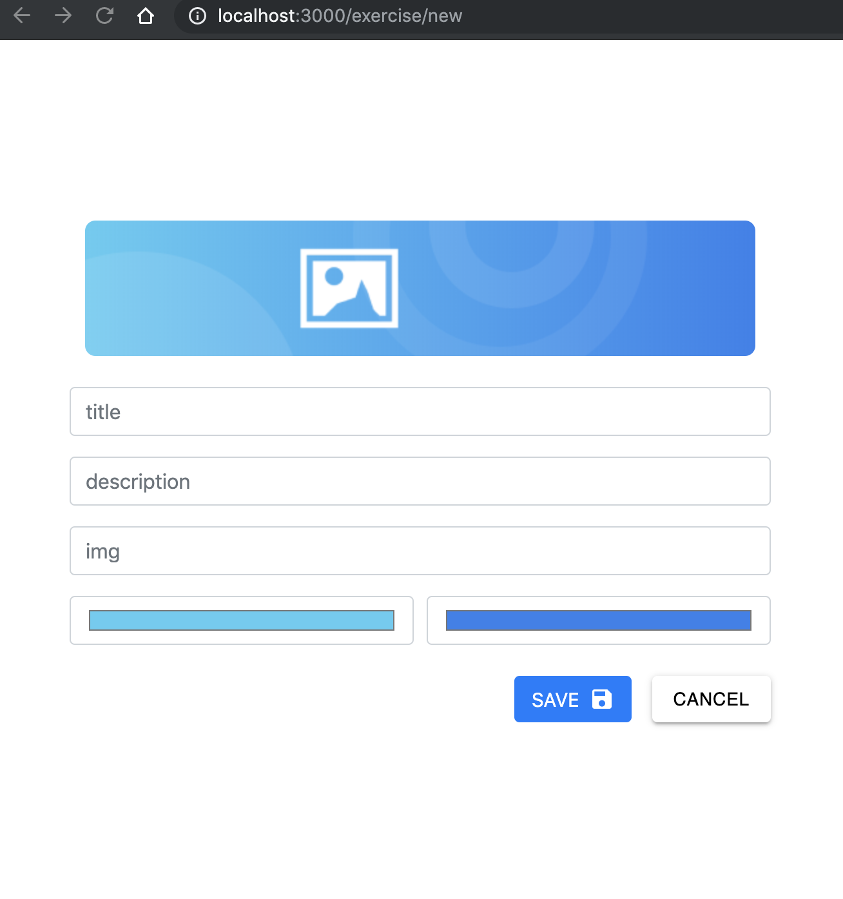
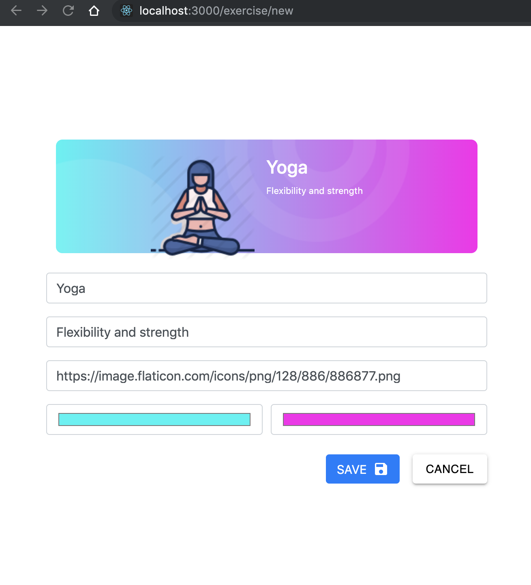
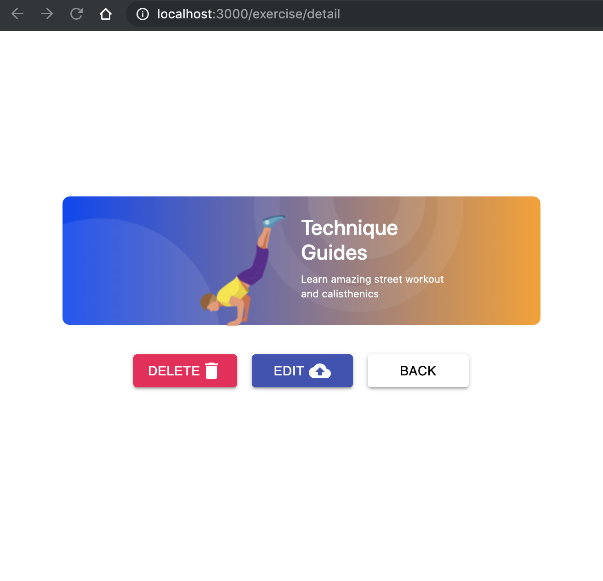
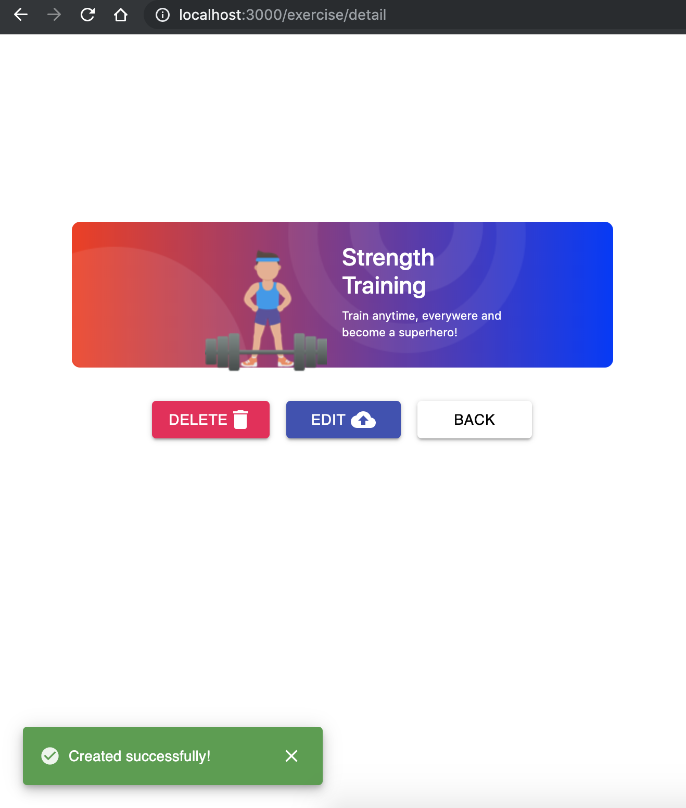

# Fitness App

#### This project is a Fitness Exercise website to learn React JS thanks to the developer [Raul Palacios](https://github.com/RpL02) following his video tutorials on [Youtube](https://www.youtube.com/watch?v=yFAIMEupsuo&list=PLIddmSRJEJ0vEBB6ECegg35IQ-sWjSDdo).

----------

### All Exercises
<p align="center">
  <kbd>
    
  </kbd>
</p>
<br/>
<p align="center">
  <kbd>
    
  </kbd>
</p>

#
### New Exercise

<div align="center">
  <kbd>
    
  </kbd>
  <br/><br/>
  <h4>Form with validation in case of not filling the fields</h4>
  <kbd>
    
  </kbd>
  <br/><br/>
  <h4>Filling all the fields</h4>
  <kbd>
    
  </kbd>
</div>

#
### Detail Exercise

<div align="center">
  <h4>The card can be deleted or edited</h4>
  <kbd>
    
  </kbd>
  <br/><br/>
  <h4>Edit</h4>
  <kbd>
    
  </kbd>
  <h4>Delete</h4>
  <kbd>
    
  </kbd>
  <h4>Confirm Delete </h4>
  <kbd>
    
  </kbd>
</div>


#
### Notifications
<div align="center">
  <h4>Create</h4>
  <kbd>
    
  </kbd>
  <br/><br/>
  <h4>Update</h4>
  <kbd>
    
  </kbd>
  <h4>Delete</h4>
  <kbd>
    
  </kbd>
</div>

#
### No Results Found

<div align="center">
  <h4>In case there is no data the following page will be shown</h4>
  <kbd>
    
  </kbd>
</div>

#
### Invalid Page

<div align="center">
  <h4>In case the page does not exist</h4>
  <kbd>
    
  </kbd>
</div>

#
### Server Error

<div align="center">
  <h4>In case the server is not active</h4>
  <kbd>
    
  </kbd>
</div>

#
# API

### Configuration

#### `/src/config.js`
```sh
const url_api = 'http://localhost:8000/api';

export { url_api };
```
##
### REQUEST

`url_api` is used in: `src/services/AxiosClient.js`
##
#### Get all exercises

> **GET** `{BASE_URL}/exercises`

> `response`:
> ```json
>[
>  {
>    "id":1,
>    "title":"Yoga",
>    "description":"Flexibility and strength",
>    "img":"https://image.flaticon.com/icons/...../exercise1.png",
>    "leftColor":"#00f4f3",
>    "rightColor":"#ff00ed"
>  },
>  {
>    "id":2,
>    "title":"Technique Guides",
>    "description":"Learn amazing street workout and calisthenics",
>    "img":"https://image.flaticon.com/icons/...../exercise2.png",
>    "leftColor":"#0142f7",
>    "rightColor":"#ff9e00"
>  },
>  {
>   "id":3,
>    "title":"Skills Training!!",
>    "description":"Learn the secrets of bodyweight technique",
>    "img":"https://image.flaticon.com/icons/...../exercise3.png",
>    "leftColor":"#00f200",
>    "rightColor":"#9a57ee"
>  }
>]
> ```
##
#### Get an exercise

> **GET** `{BASE_URL}/exercises/:id`

> `response`:
> ```json
>{
>  "exercise":{
>    "id":1,
>    "title":"Yoga",
>    "description":"Flexibility and strength",
>    "img":"https://image.flaticon.com/icons/...../exercise1.png",
>    "leftColor":"#00f4f3",
>    "rightColor":"#ff00ed"
>  }
>}
> ```
##
#### Create an exercise

> **POST** `{BASE_URL}/exercises`

> `request`:
> ```json
>{  
>  "title":"Strength Training",
>  "description":"Train anytime, everywere and become a superhero!",
>  "img":"https://image.flaticon.com/icons/...../exercise4.png",
>  "leftColor":"#8efa00",
>  "rightColor":"#531b93"
>}

> `response:`
> ```json
>{
>  "exercise":{ 
>    "title":"Strength Training",
>    "description":"Train anytime, everywere and become a superhero!",
>    "img":"https://image.flaticon.com/icons/...../exercise4.png",
>    "leftColor":"#8efa00",
>    "rightColor":"#531b93",
>    "id": 4
>  }
>}
> ```
##
#### Update an exercise

> **PUT** `{BASE_URL}/exercises/:id`

> `request`:
> ```json
>{
>  "id":3,
>  "title":"Skills Training",
>  "description":"Learn the secrets of bodyweight technique",
>  "img":"https://image.flaticon.com/icons/...../exercise3.png",
>  "leftColor":"#00f200",
>  "rightColor":"#ff9300"
>}
> ```

> `response`:
> ```json
>{
>  "exercise":{
>    "id":3,
>    "title":"Skills Training",
>    "description":"Learn the secrets of bodyweight technique",
>    "img":"https://image.flaticon.com/icons/...../exercise3.png",
>    "leftColor":"#00f200",
>    "rightColor":"#ff9300"
>  }
>}
> ```

#
#### Delete an exercise
> **DELETE** `{BASE_URL}/exercises/:id`

> `response`:
> ```json
> {
>  "msg":"deleted"
>}
> ```

#
#### Dependencies
<table>
	<tr>
		<th>Package</th>
		<th>Version</th>
 	</tr>
  <tr>
    <td>react</td>
    <td>16.8.6</td>
 	</tr>
  <tr>
    <td>react-dom</td>
    <td>16.8.6</td>
 	</tr>
  <tr>
    <td>react-router-dom</td>
    <td>5.0.1</td>
 	</tr>
  <tr>
    <td>react-scripts</td>
    <td>3.0.1</td>
 	</tr>
  <tr>
    <td>react-flexbox-grid</td>
    <td>2.1.2</td>
 	</tr>
 	<tr>
  	<td>@material-ui/core</td>
   	<td>4.1.1</td>
 	</tr>
	<tr>
    <td>@material-ui/icons</td>
    <td>4.2.0</td>
 	</tr>
	<tr>
    <td>axios</td>
    <td>0.19.0</td>
 	</tr>
</table>


#
# API Project

Link
> https://github.com/lisset-orozco/FitnessAPI

#### `node v12.3.1`

`$ npm install`
`$ npm start`

or

`$ yarn install`
`$ yarn start`

